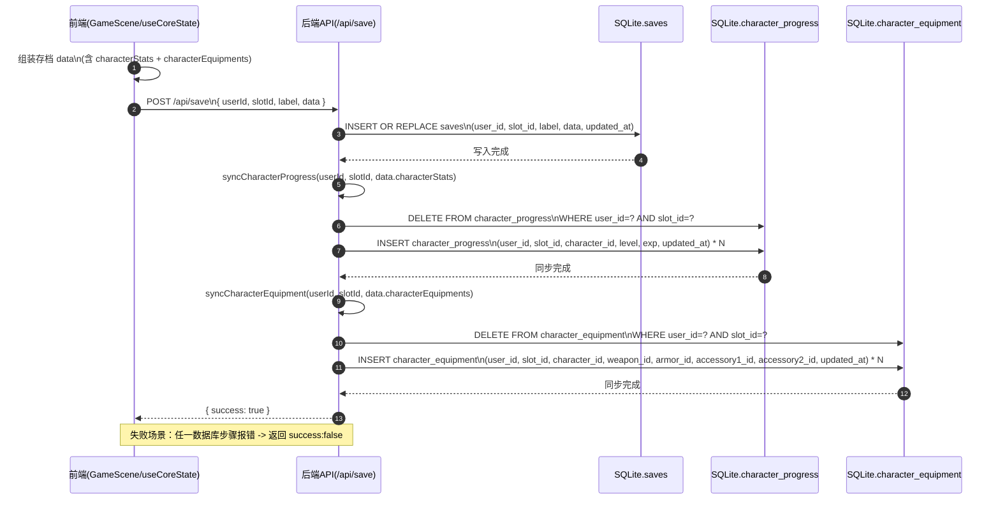
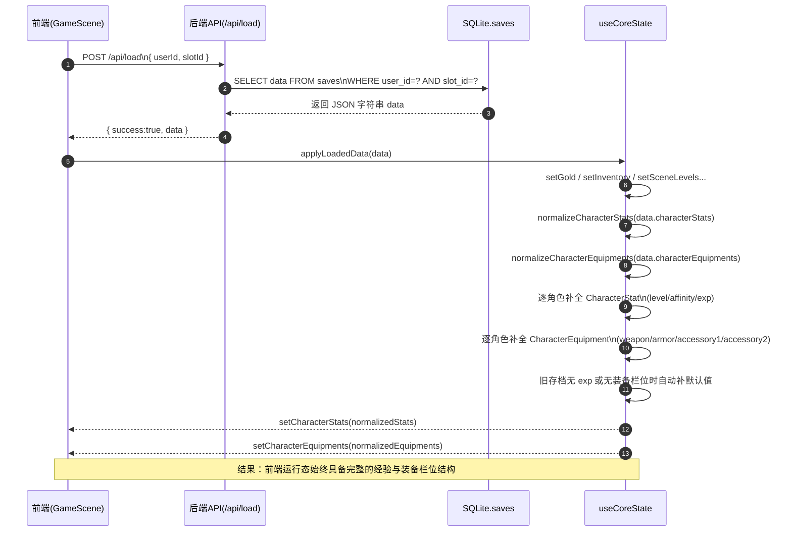

# 战斗数据架构与引用逻辑指南 (Battle Data Architecture)

本文档旨在概述项目中用于战斗及相关系统（如角色成长、道具使用、异常状态结算等）的核心数据结构及其相互之间的引用逻辑。本项目采用了**数据驱动 (Data-Driven)** 和 **SoA (Structure of Arrays)** 的设计模式，以实现高度的扩展性和极致的查询性能。

---

## 1. 核心目录与文件分布

所有的战斗强相关静态数据主要分布在以下目录和文件中：

- **`data/battle-data/`** (战斗核心数值表与规则字典)
  - `base_stats_table.ts`: 1~100 级基础属性成长表（包含 HP/MP/ATK 等的极速查表函数）。
  - `exp_table.ts`: 1~100 级升级所需的静态总经验值表。
  - `status_effects.ts`: 异常状态枚举与战斗引擎规则配置表。
- **`data/characters/`** (角色个体数据)
  - `char_*.ts`: 各角色的导出配置文件中，包含了 `battleData` 节点，定义了该角色特有的数值修正比例、职业设定与技能解锁等级。
- **`data/`** (泛用物品系统，兼顾战斗)
  - `item-equip.ts`: 战斗装备数据（武器、防具、饰品等），包含加成属性 `stats`。
  - `item-itm.ts`: 战斗与地图消耗品道具数据，包含恢复与状态影响配置 `consumableEffects`。

---

## 2. 角色战斗面板属性的计算逻辑

在本项目中，角色的“最终面板属性”是在运行时动态计算合成的，任何系统都不应直接存储角色的最终战斗数值。计算流程分为以下三步：

### 第一步：获取基础属性 (Base Stats)
角色当前等级决定了其肉体强度的基准值。通过查表函数极速获取：
```typescript
import { getBaseStats } from '../data/battle-data/base_stats_table';
const base = getBaseStats(character.level);
// base 包含: hp, mp, atk, def, matk, mdef, agi, luk
```

### 第二步：角色个体数值修正 (Character Multipliers)
每个角色由于职业或人设的不同，对基础属性有不同的放大/缩小比例。该数据存储在角色个体的 `battleData.statMultipliers` 中。
```typescript
// 修正后的攻击力 = 基础攻击力 * (角色攻击力修正比率 / 100)
const rawAtk = Math.round(base.atk * (character.battleData.statMultipliers.atk / 100));
```

### 第三步：装备数值加成 (Equipment Stats)
读取角色当前穿戴的装备，遍历累加其 `stats` 属性。由于装备属性（`ItemStats`）与基础属性字典（`BaseStats`）使用了完全一致的键名（如 `atk`, `matk`），可以通过循环优雅地合成：
```typescript
import { ITEMS_EQUIP } from '../data/item-equip';

// ... 将 rawAtk 等结合装备属性，得出最终面板
let finalAtk = rawAtk + (equippedWeapon.stats.atk || 0) + (equippedArmor.stats.atk || 0);
```

---

## 3. 经验值与等级成长系统

由于直接在引擎中进行幂运算和浮点运算存在性能消耗及潜在的边界 BUG，本项目将复杂的经验公式前置计算，沉淀为了静态经验表：

- **引用位置**: `data/battle-data/exp_table.ts` 中的 `EXP_TABLE` 数组。
- **判断逻辑**: 
  数组的索引（Index）严格对应角色的等级。例如 `EXP_TABLE[50]` 的值就是升到 50 级所需的**总累计经验**。
  ```typescript
  if (character.totalExp >= EXP_TABLE[character.level + 1]) {
      // 触发升级逻辑
  }
  ```

### 3.1 前端运行时经验结算与升级入口

- **核心状态 Hook**: `hooks/useCoreState.ts`
  - `addCharacterExp(characterId, gainedExp)`: 经验发放统一入口。
  - `applyExpGainToStat(...)`: 按 `EXP_TABLE` 执行升级循环，处理跨级升级、满级清零经验。
  - `normalizeCharacterStats(...)`: 读档兼容层，旧存档缺失 `exp` 字段时自动补 `0`。
- **任务奖励接入点**:
  - `components/QuestBoardModal.tsx` 在任务交付时读取 `quest.rewards.experience`。
  - `components/GameScene.tsx` 将任务经验发放到 `char_1`（玩家角色）。

### 3.2 数据库存储与同步位置（等级/经验）

> 说明：角色等级与经验属于“可持久化进度数据”，由前端 `characterStats` 与后端表 `character_progress` 双向协作。

- **后端数据表定义**: `database-server/index.js`
  - 表名：`character_progress`
  - 主字段：`user_id`, `slot_id`, `character_id`, `level`, `exp`, `updated_at`
  - 约束：`UNIQUE(user_id, slot_id, character_id)`
  - 索引：
    - `idx_character_progress_user_slot`
    - `idx_character_progress_character`

- **存档写入同步**: `database-server/index.js`
  - 在 `/api/save` 路由中，保存 `saves` 表后调用 `syncCharacterProgress(...)`。
  - `syncCharacterProgress(...)` 会基于 `data.characterStats` 重建当前槽位的角色进度记录（先删后插）。

- **存档删除联动**: `database-server/index.js`
  - `/api/delete` 路由中，删除存档时额外清理 `character_progress` 对应槽位记录。

- **账号迁移联动（Discord）**: `database-server/index.js`
  - `/api/auth/discord/migrate` 中新增：
    - 迁移前清理目标账号旧 `character_progress`
    - 迁移时把源账号 `character_progress` 更新到目标账号

- **前端存档数据类型**: `services/db.ts`
  - `GameSaveData.characterStats` 与 `saveGame(...).data.characterStats` 已统一为 `CharacterStat`（`level/affinity/exp`）。
  - 与后端 `character_progress` 保持字段语义一致，避免经验字段丢失。

### 3.3 装备栏位数据结构与初始化

> 说明：角色装备数据与等级经验类似，属于“可持久化进度数据”。装备 ID 来源于 `data/item-equip.ts`，空栏位统一使用 `null`。

- **前端类型定义**: `types.ts`
  - `CharacterEquipment` 包含四个栏位：
    - `weaponId`
    - `armorId`
    - `accessory1Id`
    - `accessory2Id`
  - 四个字段类型均为 `string | null`，其中 `null` 明确表示“未装备”。

- **初始装备配置**: `utils/gameConstants.ts`
  - `INITIAL_CHARACTER_WEAPON` 继续作为“角色初始武器来源”。
  - `INITIAL_CHARACTER_EQUIPMENT` 以其为基础构建完整四栏位：
    - 武器栏优先填入 `INITIAL_CHARACTER_WEAPON[charId]`
    - 防具/饰品默认 `null`

- **读档归一化与兼容**: `hooks/useCoreState.ts`
  - `normalizeCharacterEquipments(...)` 用于处理旧档或异常数据：
    - 旧存档缺失 `characterEquipments` 时，回退到 `INITIAL_CHARACTER_EQUIPMENT`
    - 非法 ID 或类别不匹配时置为 `null`
    - 类别约束：`weaponId -> wpn`，`armorId -> arm`，`accessory1/2Id -> acs`

### 3.4 数据库存储与同步位置（角色装备）

- **后端数据表定义**: `database-server/index.js`
  - 表名：`character_equipment`
  - 主字段：`user_id`, `slot_id`, `character_id`, `weapon_id`, `armor_id`, `accessory1_id`, `accessory2_id`, `updated_at`
  - 约束：`UNIQUE(user_id, slot_id, character_id)`
  - 空槽位：四个装备栏位均允许 `NULL`
  - 索引：
    - `idx_character_equipment_user_slot`
    - `idx_character_equipment_character`

- **存档写入同步**: `database-server/index.js`
  - `/api/save` 在执行完 `syncCharacterProgress(...)` 后继续执行 `syncCharacterEquipment(...)`。
  - `syncCharacterEquipment(...)` 同样采用“先删后插”策略重建当前槽位装备记录。

- **存档删除联动**: `database-server/index.js`
  - `/api/delete` 在删除存档时，联动清理 `character_equipment` 对应槽位数据。

- **账号迁移联动（Discord）**: `database-server/index.js`
  - `/api/auth/discord/migrate` 中新增：
    - 迁移前清理目标账号旧 `character_equipment`
    - 迁移时将源账号 `character_equipment` 更新到目标账号

- **前端存档数据类型**: `services/db.ts`
  - `GameSaveData.characterEquipments` 与 `saveGame(...).data.characterEquipments` 已加入。
  - `components/GameScene.tsx` 存档时会把 `core.characterEquipments` 一并提交到后端。

### 3.5 存档链路时序图（前端 -> API -> saves / character_progress / character_equipment）



### 3.6 读档链路时序图（/api/load -> applyLoadedData -> normalizeCharacterStats / normalizeCharacterEquipments）




---

## 4. 消耗品道具与异常状态引擎

为了保持战斗代码的简洁，避免大量的 `switch(itemId)` 硬编码，异常状态和消耗品道具全面实现了数据抽象。

### 异常状态配置 (`status_effects.ts`)
每个状态包含完整的引擎规则：
- `defaultDuration`: 持续回合数（`-1` 为永久）。
- `skipTurn`: 为 `true` 时战斗系统将直接跳过该角色的行动（如死亡、晕眩、昏睡）。
- `persistAfterBattle`: 决定该状态是否在战斗结束后继续保留在角色身上（如 `horny` 发情保留，`poison` 中毒自动清除）。

### 消耗品效果配置 (`item-itm.ts`)
在 `ItemData.consumableEffects` 中定义：
- `recoverHpPercent` / `recoverMpPercent`: 恢复百分比（0.0 ~ 1.0）。
- `removeStatus`: 使用后解除的状态ID数组（例如清醒药包含 `['sleep', 'stun']`）。
- `applyStatus`: 使用后附带的状态ID数组（例如女神遗香包含 `['horny']`）。
- `revive`: 是否为复活道具（仅限对 `dead` 状态目标使用）。

**引擎执行范例**：
```typescript
function useConsumable(item, target) {
  const effects = item.consumableEffects;
  if (!effects) return;
  
  if (effects.recoverHpPercent) target.hp += target.maxHp * effects.recoverHpPercent;
  if (effects.removeStatus) target.status = target.status.filter(s => !effects.removeStatus.includes(s));
  if (effects.applyStatus) target.status.push(...effects.applyStatus);
}
```

---

## 5. 敌人战斗单位创建流程

敌人战斗单位的数据来源与角色不同，采用任务配置驱动的动态创建模式。

### 5.1 数据来源映射

| 数据项 | 来源 | 说明 |
|--------|------|------|
| 敌人ID | `quest-list.ts` → `battle_config.enemies[].enemy_id` | 任务配置中指定的敌人 |
| 敌人等级 | `quest-list.ts` → `star` | 任务星级（1-10）作为敌人等级 |
| 敌人名称 | `enemies.ts` → `name` | 敌人基础信息 |
| 敌人行动 | `enemies.ts` → `actions` | AI行动配置（技能ID、优先级、触发条件） |
| 敌人特性 | `enemies.ts` → `traits` | 属性抗性、状态免疫等 |
| 基础属性 | `base_stats_table.ts` → `getBaseStats(level)` | 根据等级查表获取 |

### 5.2 创建流程

```typescript
import { createEnemyParty } from './battle-system';
import { QUESTS } from './data/quest-list';

// 获取任务配置
const quest = QUESTS['0101'];

// 创建敌人队伍
const enemyUnits = createEnemyParty({
  enemies: quest.battle_config.enemies,  // [{ enemy_id: 101, position: 1 }, ...]
  enemyLevel: quest.enemy_level,          // 敌人等级 (1-99)
  statMultipliers: { atk: 120 }           // 可选：属性修正（攻击+20%）
});
```

### 5.3 敌人数据结构

```typescript
// enemies.ts 中的敌人定义
interface EnemyData {
  id: number;           // 敌人ID
  name: string;         // 敌人名称
  battlerName: string;  // 战斗图像名称
  actions: EnemyAction[];  // AI行动配置
  traits: EnemyTrait[];    // 特性列表
  damage?: EnemyDamage;    // 基础攻击配置
}

// 创建后的战斗单位
interface EnemyBattleUnit extends BattleUnit {
  enemyData: EnemyData;    // 原始敌人数据
  actions: EnemyAction[];  // AI可用行动
  traits: EnemyTrait[];    // 特性列表
}
```

### 5.4 属性命名对照表

由于 RPG Maker 公式使用缩写，而数据层使用完整命名，存在以下映射关系：

| BaseStats (数据层) | BattleStats (战斗层) | RPG Maker 公式变量 |
|-------------------|---------------------|-------------------|
| `hp` | `maxHp`, `hp` | `mhp`, `hp` |
| `mp` | `maxMp`, `mp` | `mmp`, `mp` |
| `atk` | `atk` | `atk` |
| `def` | `def` | `def` |
| `matk` | `matk` | `mat` |
| `mdef` | `mdef` | `mdf` |
| `agi` | `agi` | `agi` |
| `luk` | `luk` | `luk` |

> **注意**：`formula-parser.ts` 内部已处理 `mat`/`mdf` 到 `matk`/`mdef` 的映射，技能公式可直接使用 RPG Maker 语法。

### 5.5 任务配置示例

```typescript
// quest-list.ts
{
  "quest_id": "0101",
  "quest_name": "发光孢子的威胁",
  "star": 1,  // 敌人等级 = 1
  "battle_config": {
    "troop_id": 1,
    "enemies": [
      { "enemy_id": 101, "position": 1 },
      { "enemy_id": 101, "position": 2 },
      { "enemy_id": 101, "position": 3 }
    ]
  }
}
```

---

## 总结
通过这种将**核心机制参数化、数值增长静态化、接口字段统一化**的数据架构，游戏的战斗系统被解耦为了纯粹的“规则执行器”。无论是添加新的极品武器、设计新的连环剧毒状态，还是调整角色的后期成长难度，都不需要再修改任何一行逻辑代码，仅需调整 `data/` 下对应的 `.ts` 配置文件即可。
